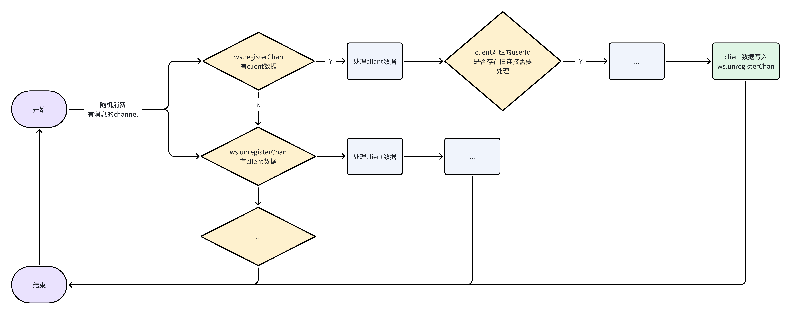
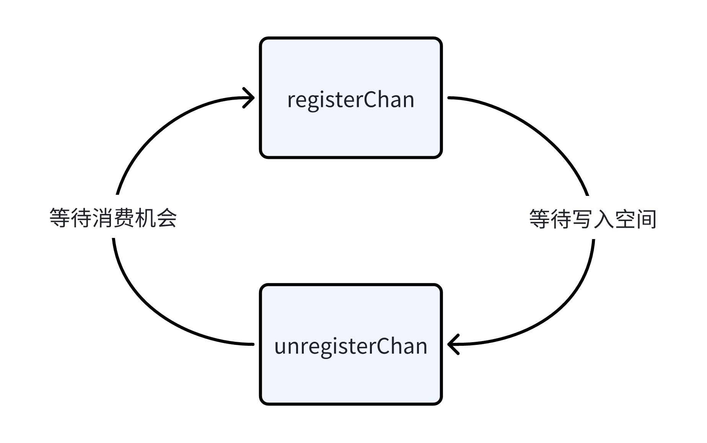
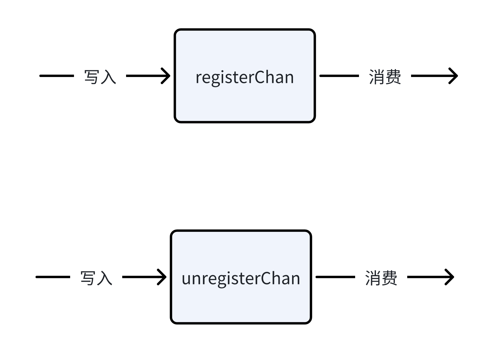

# 独立部署openim遇到的坑（1）上下线卡住

> 公司项目有im场景，我们自己在k8s中部署了3.5.1版本的[openim](https://github.com/openimsdk)，在开发和运维的过程中，我们遇到了一些问题，这里记录一下问题详情和解决的过程。


## 问题触发场景
 
我们编写了一个压力测试程序，模拟用户的典型使用场景：
1. 建立连接（上线）
2. 发送消息
3. 接收回复  
4. 断开连接（下线）

测试设置：100个并发用户账号，每个账号持续重复上述流程，模拟高频上下线场景。

## 问题现象
压力测试程序运行一段时间后（通常几分钟到几十分钟），开始出现以下现象：
- 新用户连接请求无响应，卡在WebSocket握手阶段
- 已连接用户无法正常下线
- 服务器CPU使用率正常，但连接数不再变化
- 重启openim-msggateway服务后问题暂时恢复

## 原因
先说结论：上下线排队处理，导致了多个管道（channel）之间的死锁。

以下是详细解释。

为了理解这个问题，我们需要先了解OpenIM的连接链路。

这里说的上线是指openim服务器接收客户端建立的长连接，长连接采用websocket实现。长连接建立好之后，客户端和服务器就可以向对方发送消息了。
 
同一个客户端端长连接链路上有两个服务器：`openim-msggateway-proxy`和`openim-msggateway`

`openim-msggateway-proxy`自身没有什么业务逻辑，它起到长连接负载均衡的作用，方便`openim-msggateway`的扩容。

问题出现在`openim-msggateway`，它是负责处理向客户端的长连接收发消息的核心服务。
具体地，在WsServer中定义的registerChan和unregisterChan互相之间产生了消费和生产的依赖关系，导致了死锁。

让我们来看一下相关的代码。

`WsServer`中定义了`registerChan`和`unregisterChan`：
```go
// internal/msggateway/n_ws_server.go
type WsServer struct {
    // ...
	registerChan      chan *Client // 处理上线的channel
	unregisterChan    chan *Client // 处理下线的channel
    // ...
}
```

初始化为大小为1000的有缓冲channel
```go
// internal/msggateway/n_ws_server.go
func NewWsServer(globalConfig *config.GlobalConfig, opts ...Option) (*WsServer, error) {
    // ...
	return &WsServer{
		// ...
		registerChan:    make(chan *Client, 1000),
		unregisterChan:  make(chan *Client, 1000),
        // ...
	}, nil
}
```

用户建立websocket连接时，会触发向`ws.registerChan`中写入数据
```go
// internal/msggateway/n_ws_server.go
func (ws *WsServer) wsHandler(w http.ResponseWriter, r *http.Request) {
	// 初始化wsLongConn
    
    // ...

    // 初始化一个client
	client := ws.clientPool.Get().(*Client)
	client.ResetClient(connContext, wsLongConn, connContext.GetBackground(), args.Compression, ws, args.Token)
	
    // 将client放入registerChan
    ws.registerChan <- client

    // 开始接收上行消息
	go client.readMessage()
}
```
 


程序启动时，会启动一个协程去消费`ws.registerChan`和`ws.unregisterChan`  


注意⚠️：在Go语言的select语句中，如果多个case同时就绪，会随机选择一个执行。


```go
// internal/msggateway/n_ws_server.go
func (ws *WsServer) Run(done chan error) error {
    // ...
	go func() {
		for {
			select {
			case <-shutdownDone:
				return
			case client = <-ws.registerChan:
				ws.registerClient(client)
			case client = <-ws.unregisterChan:
				ws.unregisterClient(client)
			}
		}
	}()

    // ...
}
```
 

channel `ws.registerClient`会触发一系列的执行链路，最终在`WsServer.UnRegister`中，会将client写入channel `ws.unregisterClient`中
```go
func (ws *WsServer) registerClient(client *Client) {
	oldClients, userOK, clientOK = ws.clients.Get(client.UserID, client.PlatformID)
	if !userOK {
        // ...
	} else {
        // 对已经在线的用户连接的处理
		ws.multiTerminalLoginChecker(clientOK, oldClients, client)
		// ...
	}
}

func (ws *WsServer) multiTerminalLoginChecker(clientOK bool, oldClients []*Client, newClient *Client) {
	switch ws.globalConfig.MultiLoginPolicy {
	// ...
    // 踢掉旧的连接
	case constant.AllLoginButSameTermKick:
		if !clientOK {
			return
		}
		ws.clients.deleteClients(newClient.UserID, oldClients)
		for _, c := range oldClients {
			err := c.KickOnlineMessage()
			// ...
		}
    }

    // ...
}

func (c *Client) KickOnlineMessage() error {
	// ...
	c.close()
	// ...
}

func (c *Client) close() {
	// ...
	c.longConnServer.UnRegister(c)
}

func (ws *WsServer) UnRegister(c *Client) {
	ws.unregisterChan <- c
}
```
通过以上代码分析，我们可以分析出死锁产生的根本原因

压力测试程序触发的场景是：
1. 大量用户同时反复上线、下线，频繁触发“踢旧连接”的逻辑
2. **依赖关系出现**：
   - 每次处理新连接时，都会产生断开旧连接的操作
   - 断开操作需要写入`unregisterChan`
   - `unregisterChan`和`registerChan`中的消息是随机处理
4. **死锁逐步形成**：
   - 当`registerChan`持续有数据时，`unregisterChan`可能得不到处理机会
   - `unregisterChan`逐渐被写满(1000容量)
   - 新的"踢旧连接"操作开始阻塞在写入`unregisterChan`
   - 正在处理的上线请求无法完成，后续请求开始堆积
   - 最终`registerChan`也被填满，系统完全卡死


## 解决办法
这个场景下解决死锁的原因是循环依赖，即：
- `ws.registerChan`的消费依赖于`ws.unregisterChan`有写入的空间
- `ws.unregisterChan`的消费依赖于`ws.registerChan`被消费完

 

### 核心思路
将相互依赖的两个channel的处理逻辑分离到独立的goroutine中，消除循环等待。

### 改进后的处理模式
- **原来**：单个goroutine按随机处理两个channel，可能形成依赖关系
- **现在**：两个独立goroutine并行处理各自的channel，互不影响

这样改进后：
- 即使`registerChan`有大量待处理数据，`unregisterChan`也能得到及时处理
- 消除了循环依赖，避免了死锁的根本原因
- 提高了并发处理能力

 

```go
func (ws *WsServer) Run(done chan error) error {
	// ...
	go func() {
		for {
			select {
			case <-shutdownDone:
				return
			case client = <-ws.registerChan:
				ws.registerClient(client)
			}
		}
	}()
	go func() {
		for {
			select {
			case <-shutdownDone:
				return
			case client = <-ws.unregisterChan:
				ws.unregisterClient(client)
			}
		}
	}()
	// ...
}
```

## 总结与反思
这个问题只会在一个边缘场景下触发，即同样一批用户频繁的上线、下线。我们触发这个场景也是机缘巧合。  
在分析出问题的原因之前还是一头雾水，只看表面现象，以为openim出大问题了。  
这个问题很难定位，我是通过将流量导入我们本地的电脑，通过不断给程序加日志的方式，发现了各个协程阻塞的位置。  
分析问题花了快两天时间，写出解决问题的代码只花了一分钟，也是一段神奇的体验了。

