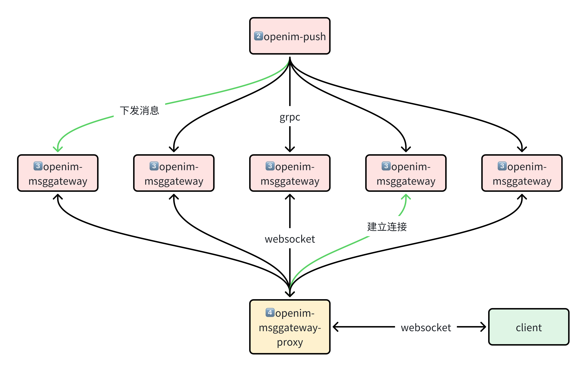

# 独立部署openim遇到的坑（2）扩容出错

> 公司项目有im场景，我们自己在k8s中部署了3.5.1版本的[openim](https://github.com/openimsdk)，在开发和运维的过程中，我们遇到了一些问题，这里记录一下问题详情和解决的过程。

## 问题简述
简单来说，就是：**用户明明在线，但收不到实时消息，只能收到推送通知，过一会儿消息才出现在聊天界面**。

这个问题只在扩容后出现，单个节点时一切正常。问题的根源是OpenIM内部的负载均衡机制出现了不一致，导致消息被发送到了错误的服务节点。

## 触发场景
对 `openim-msggateway` 进行扩容（从1个节点扩容到多个节点）

## 遇到的问题
扩容后在线用户无法收到后端推送的websocket消息，只能收到离线的通知栏推送消息，过一段时间后，可以在客户端的聊天界面中看到推送的消息

## 问题原理（通俗版）
在深入代码之前，我们先用一个比喻来理解这个问题：

想象一个快递系统：
- 📱 **客户端**：收件人
- 📍 **openim-msggateway-proxy**：客户服务中心（通过导航系统B给客户发分配快递站点）
- 🏠 **openim-msggateway**：快递站点（有多个）
- 🚚 **openim-push**：快递员（有自己的导航系统A）

实际的流程是：
- **建立连接**：收件人先到客户服务中心，客户服务中心通过导航系统B为收件人分配快递站点A
- **投递包裹**：快递员使用自己的导航系统A，独立计算这个收件人应该在哪个快递站点

正常情况下：
1. 客户服务中心的导航系统B：收件人 → 站点A
2. 快递员的导航系统A：收件人 → 站点A  
3. 收件人在站点A顺利收到包裹

但现在的问题是：
1. 客户服务中心的导航系统B：收件人 → 站点A
2. 快递员的导航系统A：收件人 → 站点B
3. 收件人在站点A等包裹，快递员却把包裹送到了站点B


   


**两个独立的导航系统给出了不同的结果！**

## 技术原因分析

### OpenIM内部连接链路
   

从图中可以看到，问题涉及两个独立的路由过程：
- **消息发送路径**：`openim-push` 直接通过一致性hash找到用户连接的 `openim-msggateway` 节点
- **客户端连接路径**：客户端通过 `openim-msggateway-proxy` 建立与 `openim-msggateway` 的websocket连接

这两个路径都需要通过一致性hash算法选择同一个 `openim-msggateway` 节点，但它们使用了不同的节点地址格式！

### 关键代码差异

问题的核心在于两个地方构建服务节点地址的方式不一致：

**第一处：openim-push 侧（发送消息时）**
```go
// open-im-server/pkg/common/discoveryregister/kubernetes/kubernetes.go
// 构建的地址格式（注意末尾的:88端口号）
host := fmt.Sprintf("%s-openim-msggateway-%d.%s-openim-msggateway-headless.%s.svc.cluster.local:88", 
    instance, i, instance, ns, port)
```

**第二处：openim-msggateway-proxy 侧（建立连接时）**
```go
// openim-msggateway-proxy/common/consistentHash.go
// 构建的地址格式（注意没有端口号）
host := fmt.Sprintf("%s-openim-msggateway-%d.%s-openim-msggateway-headless.%s.svc.cluster.local", 
    instance, i, instance, ns)
```

### 问题示例
 

假设扩容到5个节点：
1. **用户建立连接**：通过一致性hash算法，被分配到第4个节点
2. **发送消息**：由于地址格式不同，一致性hash算法可能将消息路由到第2个节点
3. **结果**：第2个节点上找不到用户连接，消息发送失败，降级为离线推送

## 解决办法
解决方案非常简单，让两个地方使用相同的地址格式：

```go
// openim-msggateway-proxy/common/consistentHash.go
func getMsgGatewayHost(ctx context.Context) []string {
    // 原来的代码
    // host := fmt.Sprintf("%s-openim-msggateway-%d.%s-openim-msggateway-headless.%s.svc.cluster.local", instance, i, instance, ns)
    
    // 修改后：补上 :88 端口号，与 openim-push 侧保持一致
    host := fmt.Sprintf("%s-openim-msggateway-%d.%s-openim-msggateway-headless.%s.svc.cluster.local:88", instance, i, instance, ns)
    
    // ... 其他代码保持不变
}
```

## 反思与总结
- **问题虽小，影响很大**：仅仅3个字符的差异，就能导致整个实时消息功能失效
- **扩容需谨慎**：单节点时不会暴露的问题，扩容后可能会浮现
- **了解内部机制很重要**：如果不了解OpenIM的内部负载均衡机制，很难快速定位问题
- **一致性是关键**：分布式系统中，各个组件对同一资源的识别方式必须保持一致

在自部署开源项目时，除了关注功能实现，还要深入了解其内部机制，才能在遇到问题时快速定位和解决。