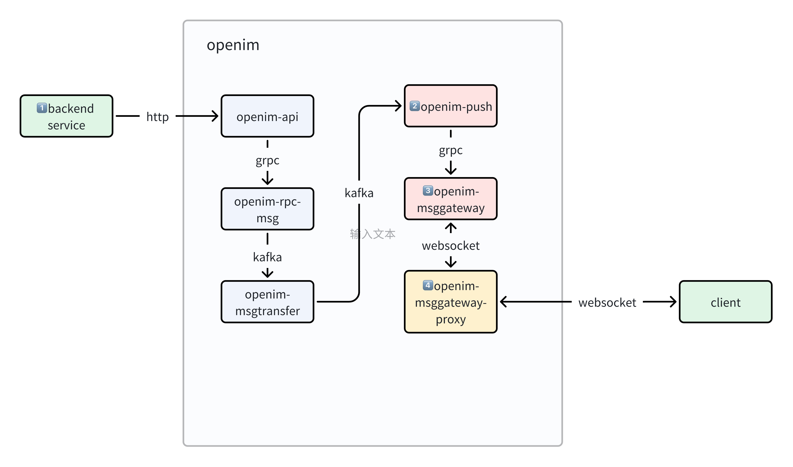
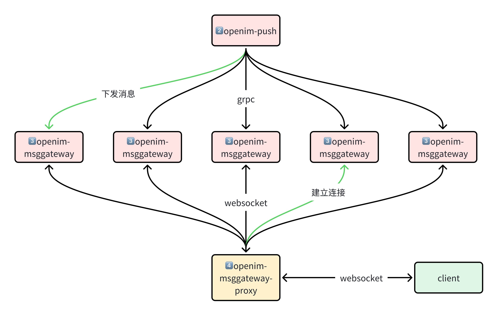

# 独立部署openim遇到的坑（3）扩容出错

> 公司项目有im场景，我们自己在k8s中部署了3.5.1版本的[openim](https://github.com/openimsdk)，在开发和运维的过程中，我们遇到了一些问题，这里记录一下问题详情和解决的过程。


## 触发场景
对`openim-msggateway`进行扩容

## 遇到的问题
扩容后在线用户无法收到后端推送的websocket消息，只能收到离线的通知栏推送消息，过一段时间后，可以在客户端的聊天界面中看到推送的消息

## 原因
一句话解释：代码的bug，一致性hash算法发生在`openim-msggateway`的输入侧和输出侧，两侧的一致性hash算法输入不一致，导致路由失效。

这么绕口的一句话，是怎么回事呢，还需要了解一下openim内部的连接链路

 
问题出现在后端下发消息到客户端的过程，从这数据流向上来看，

`openim-msggateway`的输入侧是 2️⃣`openim-push`  
`openim-msggateway`的输出侧是 4️⃣`openim-msggateway-proxy`

即，`openim-push`通过grpc调用`openim-msggateway`的消息下发接口，`openim-msggateway`再通过websocket长连接将消息推送给客户端。


以下代码是拼接`openim-msggateway`的域名，并用其初始化一致性hash变量
```go
// open-im-server/pkg/common/discoveryregister/kubernetes/kubernetes.go

// 获取所有的openim-msggateway的域名
// like openimserver-openim-msggateway-0.openimserver-openim-msggateway-headless.openim-lin.svc.cluster.local:88
func getMsgGatewayHost(ctx context.Context, gatewayName string) []string {
	port := 88
	instance := "openimserver"
	selfPodName := os.Getenv("MY_POD_NAME")
	replicas := os.Getenv("MY_MSGGATEWAY_REPLICACOUNT")
	ns := os.Getenv("MY_POD_NAMESPACE")
	gatewayEnds := strings.Split(gatewayName, ":")
	if len(gatewayEnds) != 2 {
		log.ZError(ctx, "msggateway RpcRegisterName is error:config.RpcRegisterName.OpenImMessageGatewayName", errors.New("config error"))
	} else {
		port, _ = strconv.Atoi(gatewayEnds[1])
	}
	nReplicas, _ := strconv.Atoi(replicas)
	podInfo := strings.Split(selfPodName, "-")
	instance = podInfo[0]
	var ret []string
	for i := 0; i < nReplicas; i++ {
		host := fmt.Sprintf("%s-openim-msggateway-%d.%s-openim-msggateway-headless.%s.svc.cluster.local:%d", instance, i, instance, ns, port)
		ret = append(ret, host)
	}
	log.ZInfo(ctx, "getMsgGatewayHost", "instance", instance, "selfPodName", selfPodName, "replicas", replicas, "ns", ns, "ret", ret)
	return ret
}

// ...

// 将获取的域名，存入gatewayConsistent
func NewK8sDiscoveryRegister(gatewayName string) (discoveryregistry.SvcDiscoveryRegistry, error) {
	gatewayConsistent := consistent.New()
	gatewayHosts := getMsgGatewayHost(context.Background(), gatewayName)
	for _, v := range gatewayHosts {
		gatewayConsistent.Add(v)
	}
	return &K8sDR{gatewayHostConsistent: gatewayConsistent}, nil
}
```

以下代码通过userId，做hash，得到openim-msggateway的域名
```go
// open-im-server/pkg/common/discoveryregister/kubernetes/kubernetes.go


func (cli *K8sDR) GetUserIdHashGatewayHost(ctx context.Context, userId string) (string, error) {
	host, err := cli.gatewayHostConsistent.Get(userId)
	if err != nil {
		log.ZError(ctx, "GetUserIdHashGatewayHost error", err)


	}
	return host, err
}
```

另一方面，客户端通过 4️⃣`openim-msggateway-proxy`，与`openim-msggateway`建立websocket连接
```go
func NewGatewayConsistent() *consistent.Consistent {
	gatewayConsistent := consistent.New()
	gatewayHosts := getMsgGatewayHost(context.Background())
	for _, v := range gatewayHosts {
		gatewayConsistent.Add(v)
	}
	return gatewayConsistent
}

// like openimserver-openim-msggateway-0.openimserver-openim-msggateway-headless.openim-lin.svc.cluster.local
func getMsgGatewayHost(ctx context.Context) []string {
	instance := "openimserver"
	selfPodName := os.Getenv("MY_POD_NAME")
	replicas := os.Getenv("MY_MSGGATEWAY_REPLICACOUNT")
	ns := os.Getenv("MY_POD_NAMESPACE")
	nReplicas, _ := strconv.Atoi(replicas)
	podInfo := strings.Split(selfPodName, "-")
	instance = podInfo[0]
	var ret []string
	for i := 0; i < nReplicas; i++ {
		host := fmt.Sprintf("%s-openim-msggateway-%d.%s-openim-msggateway-headless.%s.svc.cluster.local", instance, i, instance, ns)
		ret = append(ret, host)
	}
	log.Info("msggateway host info", "ret", ret)
	return ret
}
```

客户端向4️⃣`openim-msggateway-proxy`发起建立websocket请求时，通过userId计算hash，得到`openim-msggateway`的域名
```go
func NewMActor(a gate.Agent, sessionId string, appParam *ParamStru) (MActor, error) {
	ret := &MActorIm{param: appParam, a: a, SessionId: sessionId, closeChan: make(chan bool, 1), nChanLen: 10, ReceivMsgChan: make(chan interface{}, 10), isclosing: false}
	///////////////////////////////////////
	host, err := common.GatewayConsistent.Get(appParam.UserId)

	if err != nil {
		return nil, errors.New("get gatewayConsistent error")
	}
	mWsClient, err := network.NewWSClient(sessionId, host, appParam.UrlPath)
	if err != nil {
		return nil, err
	}
	ret.mWsClient = mWsClient
	///////////////////////////////////////
	go ret.run()
	return ret, nil
}
```

写到这里，答案已经跃然纸上。

`openim-push`中，一致性hash初始化的输入是这样：  
`openimserver-openim-msggateway-0.openimserver-openim-msggateway-headless.openim-lin.svc.cluster.local:88`

另一边，4️⃣`openim-msggateway-proxy`中，一致性hash初始化的输入是这样：  
`openimserver-openim-msggateway-0.openimserver-openim-msggateway-headless.openim-lin.svc.cluster.local`


可以看到在4️⃣`openim-msggateway-proxy`中的域名是没有端口号的！


如果`openim-msggateway`的数量大于1，两边一致性hash初始化的输入是不同，对于同一个userId，**当然(!)***非常可能会*得到不同的域名啦！

举例说明一下

 

## 解决办法

openimserver-openim-msggateway-0.openimserver-openim-msggateway-headless.namespace.svc.cluster.local

openim-push 
env
MY_MSGGATEWAY_REPLICACOUNT

这个变量需要与msggateway 数量一致


## 反思
